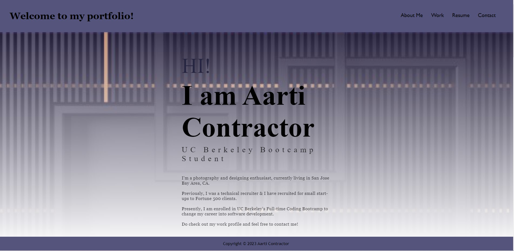

# Portfolio - Aarti Contractor

## Technology Used 

| Technology Used         | Resource URL           | 
| ------------- |:-------------:| 
| HTML    | [https://developer.mozilla.org/en-US/docs/Web/HTML](https://developer.mozilla.org/en-US/docs/Web/HTML) | 
| CSS     | [https://developer.mozilla.org/en-US/docs/Web/CSS](https://developer.mozilla.org/en-US/docs/Web/CSS)      |   
| Git | [https://git-scm.com/](https://git-scm.com/)     |    

## Description 

[Visit the Deployed Site](https://aarticontractor.github.io/aarticontractor_portfolio/)

In this project, I have created a web application from scratch.which displays my portfolio page

At a minimum, your project README needs a title and a short description explaining the what, why, and how. What was your motivation? Why did you build this project? (Note: The answer is not "Because it was a homework assignment.") What problem does it solve? What did you learn? What makes your project stand out? 


## Table of Contents

If your README is very long, add a table of contents to make it easy for users to find what they need.

* [Portfolio Highlights and Usage](#portfolio-highlights-and-usage)
* [Learning Points](#learning-points)
* [Author Info](#author-info)
* [Credits](#credits)


## Portfolio Highlights and Usage


WHEN I load my portfolio, my name, a recent photo, and links to sections about me, my work, and my contact details are presented.





When I click on the work section link, the UI scrolls to the work section with titled images of my projects in GitHub.


WHEN I am presented with the developer's first application
THEN that application's image should be larger in size than the other


WHEN I click on the images of the applications
THEN I am taken to that deployed application


WHEN I resize the page or view the site on various screens and devices
THEN I am presented with a responsive layout that adapts to my viewport


```md

```


## Learning Points 

I learned the following skills while doing this project:


- Advanced properties of CSS (styling, display, text, flexbox,media query, variables etc) to make the page responsive.
- The Git flow (clone, add, commit, push, pull, etc)
- Made use of Google DevTools 
- Pseudo elements- for hovering effect


## Author Info

```md
### Aarti Contractor


- Portfolio: https://aarticontractor.github.io/aarticontractor_portfolio/
- Linkedin: https://www.linkedin.com/in/aarti-contractor/
- Github: https://github.com/aarticontractor

```

The user has looked through your whole README, and gotten familiar with your application. 
This is where you take credit, and make it easy for them to learn more about you!
Direct them to the following:
- Your GitHub Profile
- Your LinkedIn
- Your Portfolio Website
- And Anything Else You Want!

Give credit where credit is due! 

If you Pseudocode or Pair Program with someone else, give them kudos in your Contributors section!


## Credits

List your collaborators, if any, with links to their GitHub profiles.

If you used any third-party assets that require attribution, list the creators with links to their primary web presence in this section.

If you followed tutorials, include links to those here as well.


© 2023 edX Boot Camps LLC. Confidential and Proprietary. All Rights Reserved.