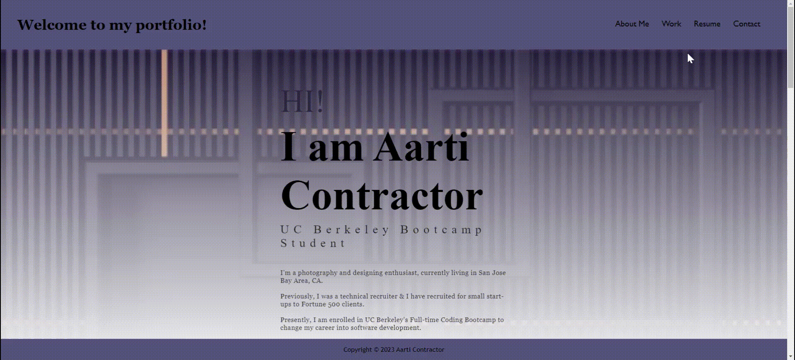
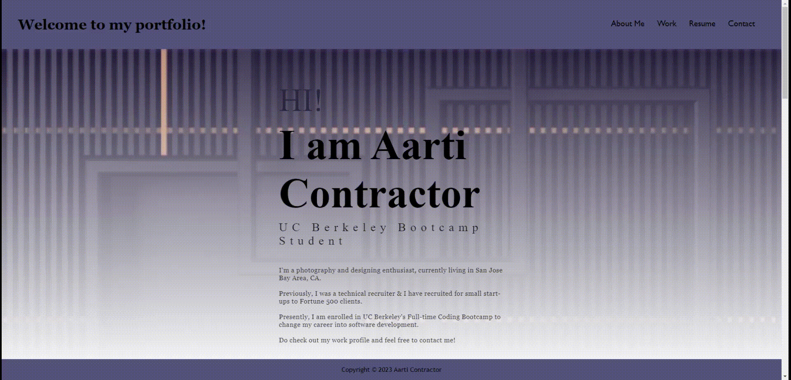

# Professional Portfolio - Aarti Contractor

## Technology Used 

| Technology Used         | Resource URL           | 
| ------------- |:-------------:| 
| HTML    | [https://developer.mozilla.org/en-US/docs/Web/HTML](https://developer.mozilla.org/en-US/docs/Web/HTML) | 
| CSS     | [https://developer.mozilla.org/en-US/docs/Web/CSS](https://developer.mozilla.org/en-US/docs/Web/CSS)      |   
| Git | [https://git-scm.com/](https://git-scm.com/)     |    

 

## Description 

[Visit the Deployed Site](https://aarticontractor.github.io/aarticontractor_portfolio/)

In this project, I have created a web application from scratch which displays my portfolio page.

It was made so that any recuiter can review samples of my work and assess whether I'm a good candidate for an open position.

The portfolio displays About me, Work, Resume, and Contact sections for recruiters to reach out to me.

 

## Table of Contents

* [Portfolio Highlights and Usage](#portfolio-highlights-and-usage)
* [Learning Points](#learning-points)
* [Author Info](#author-info)
* [Credits](#credits)

 

## Portfolio Highlights and Usage

 

When I load my portfolio, my name, a recent photo, and links to sections about me, my work, and my contact details are presented:

 
 
 

When I click on the resume section link, the UI scrolls to the resume section with my education and work experience:

 
 
 

When I click on the project link, the application's image is larger in size than the other showing a hover effect:

 
 
 

If I want to view the site on various devices with different sizes, I have a responsive layout that adapts to my screen size:

 
 
 

## Learning Points 

I learned the following skills while doing this project:

- Advanced properties of CSS (styling, display, text, flexbox,media query, variables etc) to make the page responsive.
- The Git flow (clone, add, commit, push, pull, etc)
- Made use of Google DevTools 
- Pseudo elements- for hovering effect, box sizing, and border styling

 

## Author Info

### Aarti Contractor

- Portfolio: https://aarticontractor.github.io/aarticontractor_portfolio/
- Linkedin: https://www.linkedin.com/in/aarti-contractor/
- Github: https://github.com/aarticontractor

 

## Credits

The following links were used as references in the project:

- https://css-tricks.com/
- https://getbootstrap.com/docs/5.3/getting-started/introduction/

 

© 2023 edX Boot Camps LLC. Confidential and Proprietary. All Rights Reserved.